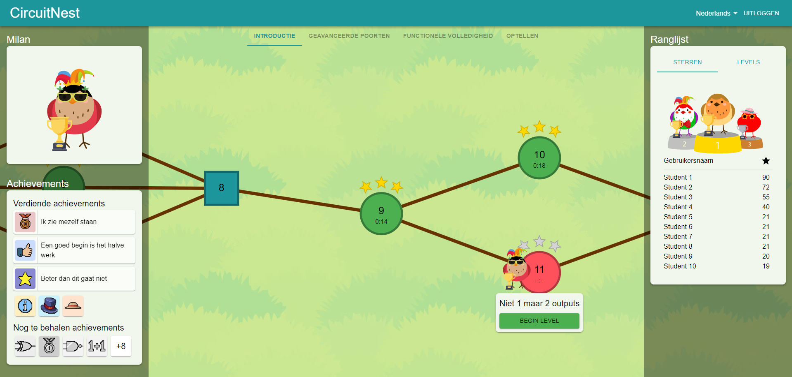

# CircuitNest
CircuitNest is an online educational platform developed for a research study on the effects of gamification. The platform uses a React [frontend](frontend/circuitnest) with a Django [backend](backend). The platform is developed with the goal of teaching logic circuits to secondary school students through interactive levels. Circuitnest contains the following gamification elements: levels, feedback, achievements, avatar, leaderboard, stars, content unlocking, tutorial, narrative. Currently no demo of the platform is live. To build a local version of the platform follow the steps described below. 



## Installation
CircuitNest runs through the use of Docker compose. To use this first ensure Docker is installed on your system (follow [this guide](https://docs.docker.com/compose/install/) if it is not yet installed). Next, before starting the environment it is important to create credentials for the superuser account. This can be done be creating a `.env.secret` file in the backend folder containing the following fields:
```
SECRET_KEY="some_key"
DJANGO_SUPERUSER_USERNAME=Username
DJANGO_SUPERUSER_EMAIL=Email
DJANGO_SUPERUSER_PASSWORD=Password
```
This secret key can be created through [Djecrety](https://djecrety.ir/), the other fields can be anything. Make sure to never push this file to any repository.

Then either compose the development environment:
```
docker compose -f compose.yaml up
```
or the production environment (preferably on a server):
```
docker compose -f compose.prod.yaml up
```
The environment should now be accessible on your machine. This would be either `localhost` for the development environment or the server IP address for the production environment. 

## Usage
With the environment running, it is important to add content to the platform. This can be done through the admin panel found at [localhost:8000/api/admin/](localhost:8000/api/admin/) in development or [your_address/api/admin/](localhost:8000/api/admin/) in production. 

Most content is related directly to a classroom to enable different classes to be fully disconnected. After creating a classroom, scenarios can be added to that classroom and in turn levels can be added to the scenarios. On top of the levels itself, achievements, and cosmetics can be added to enable the gamification to work. This process is explained in more detail [here](resources/adding_content.md).

## Support
For any support, feel free to create an issue. I can not promise a quick response as this project is not in development anymore. 

## Authors and acknowledgment
This project has been created and developed by [Milan van Gool](https://github.com/MvGool). It was built on top of an earlier project by Sepehr Rezaei which can be found [here](https://gitlab.tue.nl/20210079/lcgq).

## License
This project is licensed under the [MIT license](LICENSE).

## Project status
As the research project has been concluded, this project is not actively worked on any further. Feel free to copy and modify this project. 